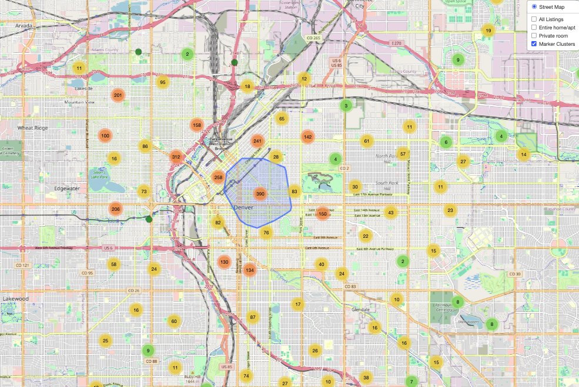
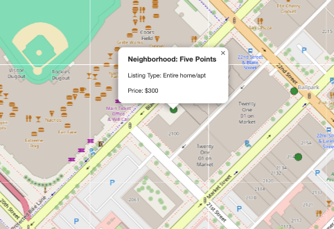
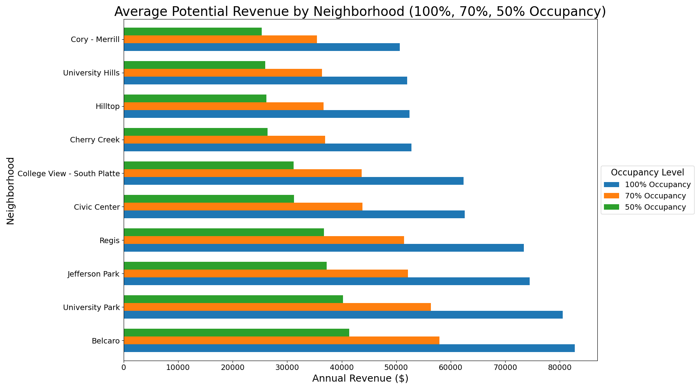
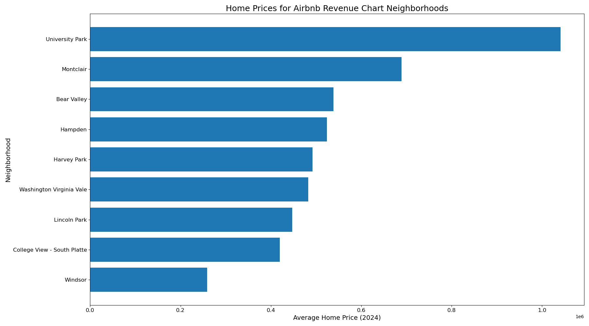
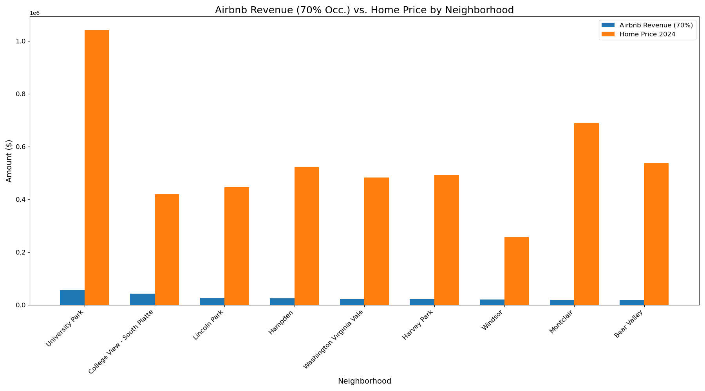
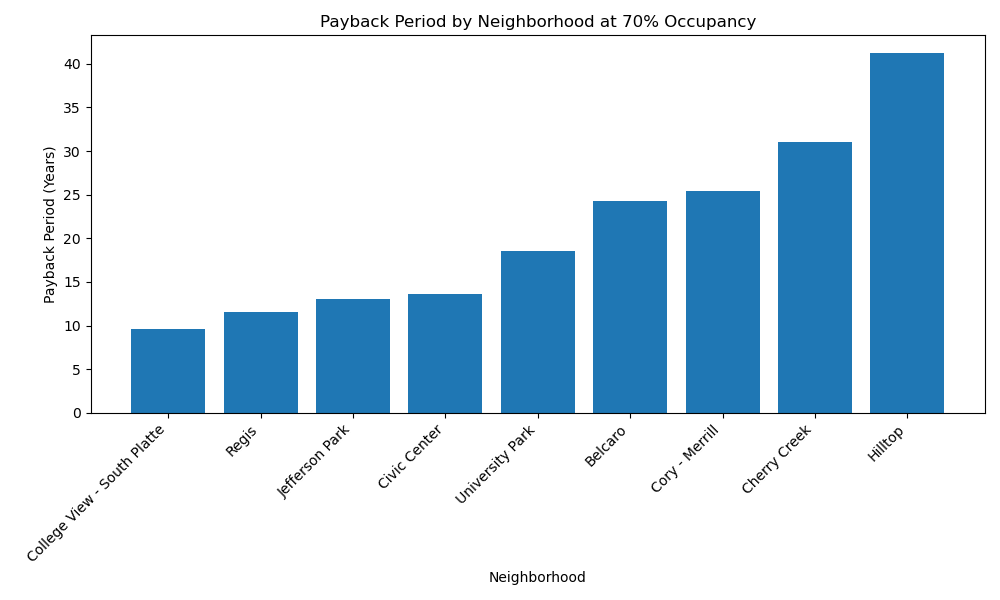
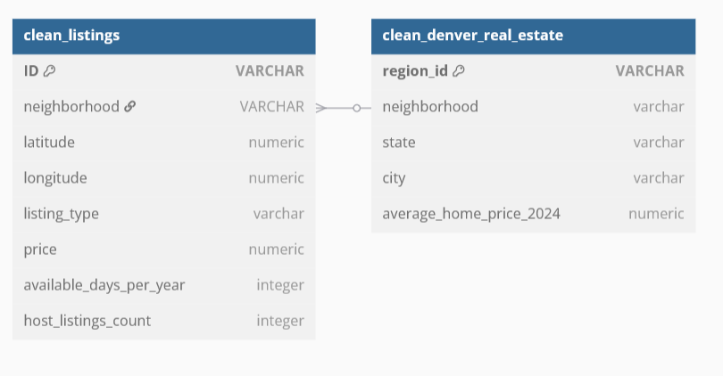

# Denver Airbnb Analysis
Creators: Luke Roberts, Kanchan Kumari, Angelina Murdock<br>
Date: April 2025

## Overview
This project analyzes Airbnb listings in Denver, Colorado, using a combination of JavaScript and Leaflet to create interactive maps that visualize listing density and neighborhood profitability. Data processing and cleaning were performed with Dask and Jupyter Notebook, while Matplotlib was used to generate insightful charts showcasing potential revenue and home prices. The final visualizations are deployed on GitHub Pages, providing an engaging platform for exploring Airbnb investment opportunities in Denver.

## Table of Contents
- [Features](#features)
- [Deployment](#deployment)
- [Key Findings](#key-findings)
- [Recommendation](#recommendation)
- [Methodology](#methodology)
- [Ethical Considerations](#ethical-considerations)
- [Opportunities for Further Analysis](#opportunities-for-further-analysis)
- [ERD](#erd)
- [Resources](#resources)

## Features
- **Interactive Map Visualization:** Displays Airbnb listing density across Denver neighborhoods with zoom and popup details.
- **Data Visualizations:** Bar charts displaying potential revenue and average home prices by neighborhood to identify high-performing areas.
- **Entity Relationship Diagram (ERD):** Visualizes relationships between data tables like listings, neighborhoods, and pricing.

## Deployment
**GitHub Pages Link for Map Visualization:**
- [View the Interactive Map](https://angelinamurdock.github.io/airbnb-denver-analysis/Map/)

**Local Setup:**
1. Clone the Repository:
    ```bash
    git clone https://github.com/Angelinamurdock/airbnb-denver-analysis.git
    ```
2. Open the `airbnb.ipynb` Jupyter Notebook file to view data cleaning and analysis.


## Map Visualization 
Interactive map created using Leaflet allows users to explore Airbnb listing data in Denver on a large and small scale.

#### Zoomed-out view showing overall listing density.


#### Example of a single marker with popup info.


## Key Findings
**Top Revenue Neighborhoods**:  At 70% occupancy, top earners include Belcaro, University Park, and Jefferson Park, with potential gross earnings between $35k - $60k annually.



**Home Prices in Top Revenue Neighborhoods:** High home prices do not always correlate with high Airbnb revenue or good ROI.



**Best Investment Value:** Jefferson Park and Regis offer strong revenue with lower home costs, yielding better ROI compared to pricier areas like Belcaro.



**Payback Period:**  Ranges from about 9.5 years (College View – South Platte) to over 40 years (Hilltop).




## Recommendation
- Avoid investing in Belcaro, Hilltop, and Cory-Merrill due to poor ROI.
- Jefferson Park and Regis are optimal neighborhoods for balancing cost and return.
- College View – South Platte offers the fastest ROI, making it attractive for investors.

## Methodology
### Data Processing and Visualization
**JavaScript Functions**: Used to render map layers, update visual elements based on user input, and integrate data with Leaflet for smooth map interactivity.

**Leaflet**: Used to create an interactive map that displays the distribution of Airbnb listings across Denver neighborhoods.

**Dask**: Utilized for efficient, scalable data processing to for handle large Airbnb and Zillow datasets during cleaning and transformation.

**MatplotLib**: Used to generate bar charts and other static visualizations that illustrate trends in potential revenue and average home prices by neighborhood.

## Ethical Considerations
All data used is publicly available from Inside Airbnb and Zillow, intended for research and public awareness. Proper citations were maintained, and data was only cleaned and formatted as necessary. The analysis aims to inform responsible investment, not encourage unchecked short-term rental growth.

## Opportunities for Further Analysis
- Incorporate long-term rental data to compare profitability against short-term Airbnb rentals.
- Analyze data by specific home types for more granular investment insights.
- Add map overlays for home sales trends per neighborhood.
- Break down revenue seasonally to provide monthly outlooks for investors.

## ERD


## Resources
- **DU Bootcamp Module 15:** Utilized challenge files and class materials from the bootcamp.
- [**Airbnb data**](https://insideairbnb.com/get-the-data/) 
- [**Zillow data**](https://www.zillow.com/research/data/) 
- [**Using csv files in javascript**](https://medium.com/@ryan_forrester_/read-csv-files-in-javascript-how-to-guide-8d0ac6df082a) 
- [**Dask Documentation**](https://docs.dask.org/en/stable/) 
- **ChatGPT:** Assisted with converting a .csv file to a .js file. Also used to troubleshoot code.
- [**ERD Creator**](https://dbdiagram.io/d) 

