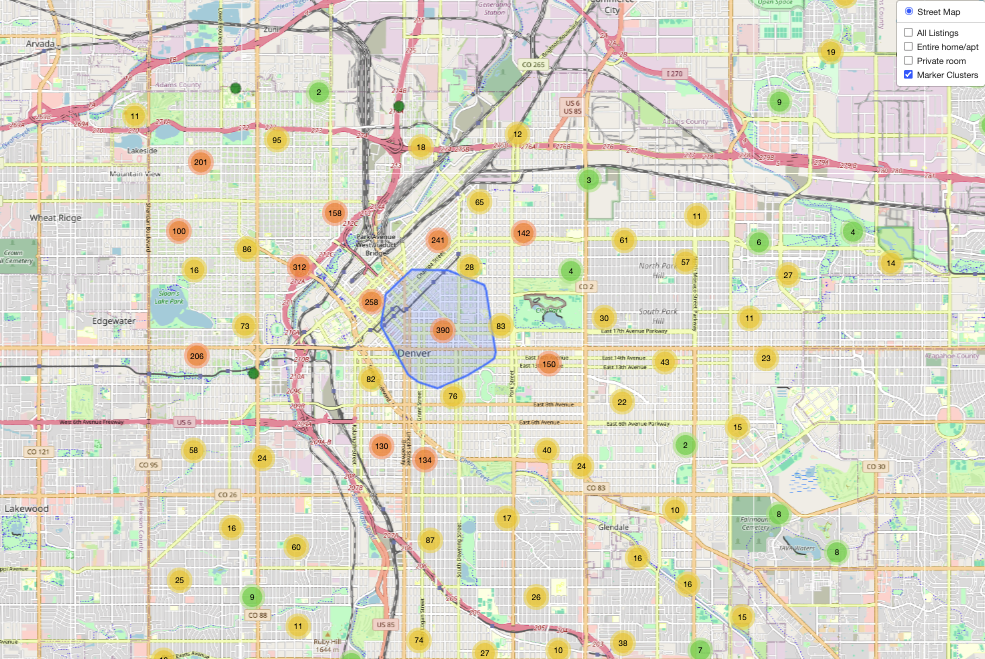
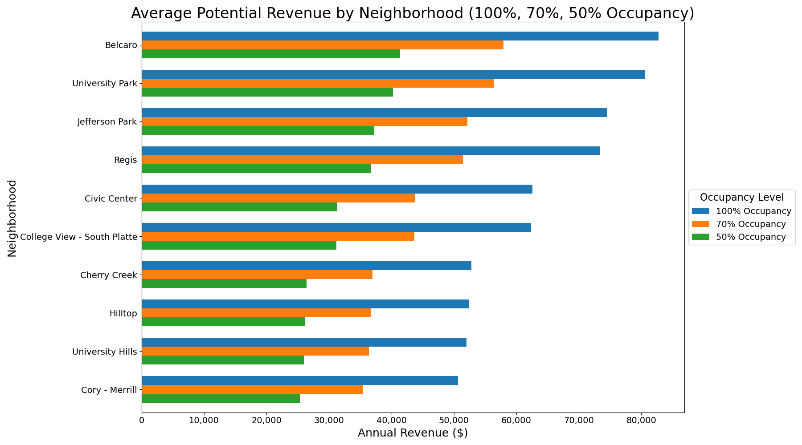
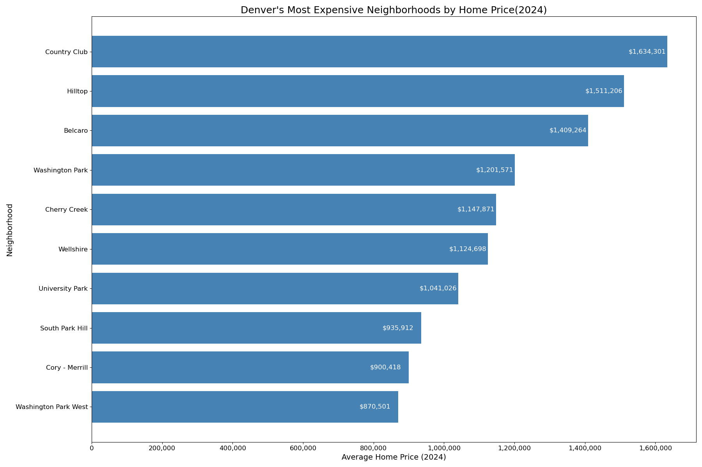
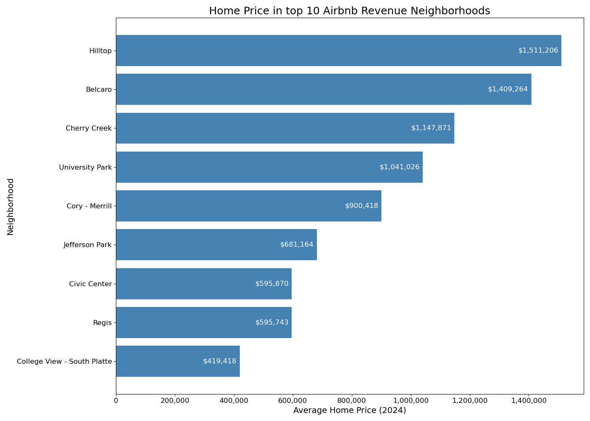
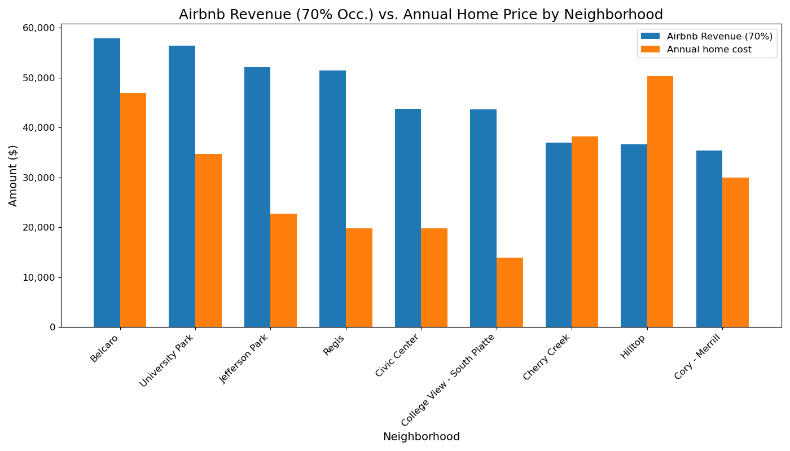

# Denver Airbnb Analysis
Creators: Luke Roberts, Kanchan Kumari, Angelina Murdock 
Date: April 2025

## Table of Contents
- [Project Description](#project-description)
- [Features](#features)
- [Reasearch Questions to Answer](#research-questions-to-answer)
- [Deployment](#deployment)
- [Key Findings](#key-findings)
- [Methodology](#methodology)
- [Opportunities for Further Analysis](#opportunities-for-further-analysis)
- [ERD](#erd)
- [Resources](#resources)

## Project Description
This project aims to analyze Airbnb listing data, specifically for Denver, Colorado, and gain insights on the listing demand, highest concentration areas, average annual income per property, and most profitable neighborhoods. This will be presented in multiple visualizations, such as an interactive map with markers for each listing and charts showing the income data. 

## Research Questions to Answer
1. What is the potential income of an Airbnb compared to the average home cost by neighborhood?
2. Which neighborhoods are the most profitable to host in?
3. Which neighborhoods have the most Airbnb listings?

## Features
- **Map Visualization:** Interactive map showing the concentration of Airbnb listings across Denver neighborhoods.
- **Data Visualizations:** Bar charts displaying potential revenue and average home prices by neighborhood to identify high-performing areas.
- **ERD**: Entity Relationship Diagram (ERD)
Visual overview of the data schema, illustrating how tables such as listings, neighborhoods, and pricing are related.

## Map Visualization 
Interactive map created using Leaflet allows users to explore Airbnb listing data in Denver on a large and small scale.
#### Zoomed-out view showing overall listing density.

#### Example of a single marker with popup info.

## Deployment
### GitHub Pages Link
- git hub pages link for the map

## Key Findings

## Methodology
### Data Processing and Visualization
**JavaScript Functions**: Used to render map layers, update visual elements based on user input, and integrate data with Leaflet for smooth map interactivity.

**Leaflet**: Used to create an interactive map that displays the distribution of Airbnb listings across Denver neighborhoods. 

**Dask**: Utilized for efficient, scalable data processing to for handle large Airbnb and Zillow datasets during cleaning and transformation.

**MatplotLib**: Used to generate bar charts and other static visualizations that illustrate trends in potential revenue and average home prices by neighborhood.

## ERD

## Opportunities for Further Analysis

## Resources
- **DU Bootcamp Module 15:** Utilized challenge files and class materials from the bootcamp.
- **Airbnb data:** https://insideairbnb.com/get-the-data/ 
- **Zillow data:** https://www.zillow.com/research/data/ 
- **Using csv files in javascript:** https://medium.com/@ryan_forrester_/read-csv-files-in-javascript-how-to-guide-8d0ac6df082a 
- **Dask:** https://docs.dask.org/en/stable/ 
- **ChatGPT:** Assisted with converting a .csv file to a .js file. Also used to troubleshoot code.

